<p align="center">
  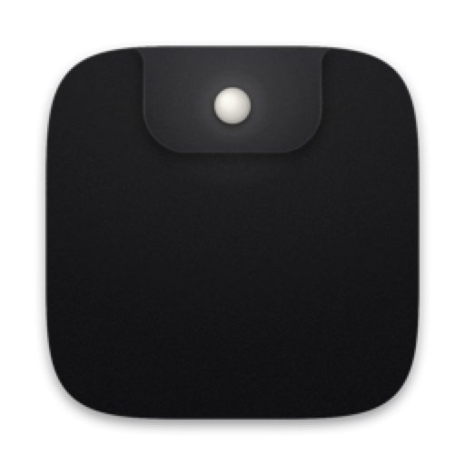
</p>

<h1 align="center">Otto</h1>

<p align="center">
  <strong>The AI assistant that lives in your notch.</strong><br>
  Hover the notch, ask anything, get back to work.
</p>

<p align="center">
  <a href="https://github.com/jke48222/otto/actions/workflows/ci.yml"></a>
  
  
  <a href="LICENSE"></a>
</p>

<p align="center">
  <a href="#build-from-source"><strong>Build from source (free)</strong></a>
  &nbsp;·&nbsp;
  <a href="https://github.com/jke48222/otto/subscription"><strong>Signed app coming soon: watch releases</strong></a>
  &nbsp;·&nbsp;
  <a href="docs/media/otto-promo.mp4">Watch the film</a>
</p>

<p align="center">
  <sub>Source code free under the MIT license · signed app coming soon as a one-time purchase · macOS 14 Sonoma or later · uses the Claude API (bring your own Anthropic key)</sub>
</p>

<p align="center">
  <a href="docs/media/otto-promo.mp4">
    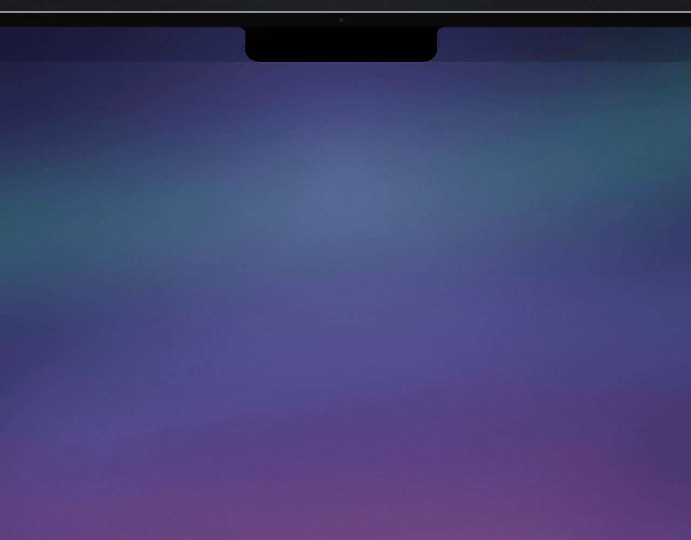
  </a>
  <br>
  <sub>Click the loop to watch the full promo video.</sub>
</p>

<p align="center"><a href="#get-started">Get started</a> · <a href="#everyday-use">Everyday use</a> · <a href="#privacy--permissions">Privacy</a> · <a href="#limits-and-known-issues">Limits</a> · <a href="#faq">FAQ</a> · <a href="#build-from-source">Build from source</a></p>

---

## What is Otto?

Otto turns the black notch at the top of your MacBook into a place to ask Claude things. Rest your
pointer on the notch and it opens with a composer, the file you just dropped in, and the page you're
reading. Get your answer, move the pointer away, and it tucks back into the camera housing.

Otto 1.1 goes further when you want it to. Ask about text you've selected in any app and paste the answer
back in place. Hold a key and talk to it. Park files on the Shelf until you need them. Turn on actions and
Claude can add an event or a reminder, or run a shortcut, once you've approved exactly what it will do. Pick
up yesterday's conversation from Recents.

It's a native Mac app written in Swift with SwiftUI and AppKit. The source build uses only Apple frameworks;
the signed app adds Sparkle for updates. It talks to the Anthropic API directly with your own key.

## Why I built it

I kept leaving what I was doing to ask Claude a quick question, and the notch was the one part of the
screen I never used. The hard part was making it open when you mean it and not when you're heading
for a menu. The hover, click and drag logic became a small state machine with its own 44 unit tests,
and a hover only counts once the pointer rests for 90 ms.

## Highlights

### One glance away

Hover the notch or press <kbd>⌥</kbd><kbd>Space</kbd> from any app. Otto opens right where you're
already looking and folds away when you're done.

<p align="center">
  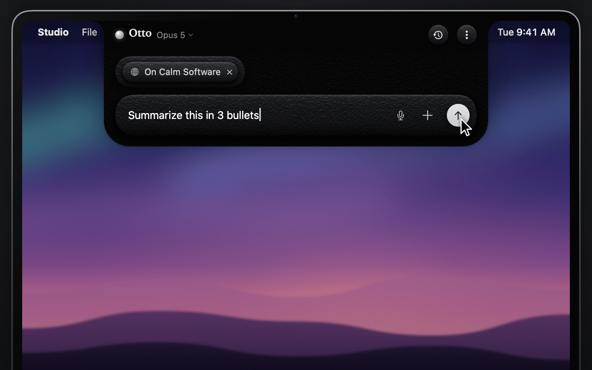
</p>

### Knows what you're looking at

Drop in files, images, PDFs and screenshots, or paste them with <kbd>⌘</kbd><kbd>V</kbd>. Reading
something in your browser? Otto offers the current tab as a chip: one click and Claude can read the
page with you.

<p align="center">
  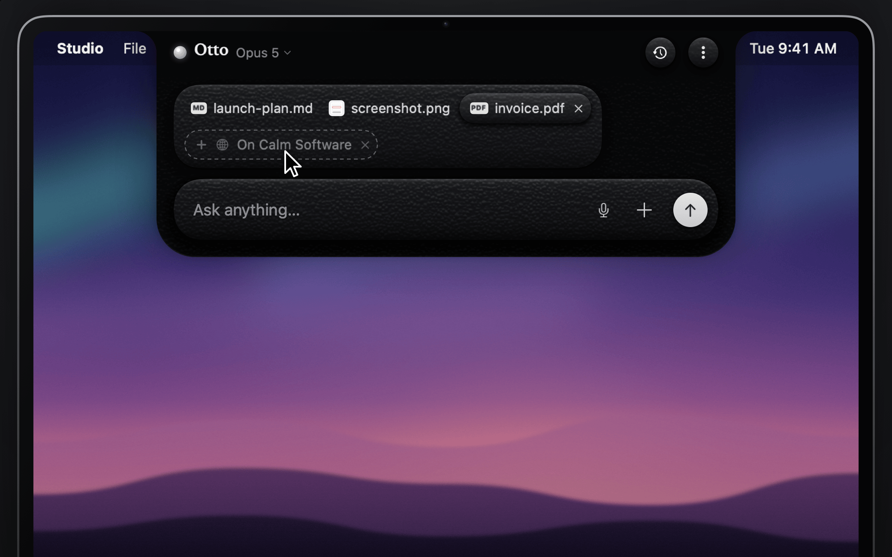
</p>

### Answers that stream in

Replies arrive as they're written, right in the notch. Claude can search the web and cite its sources,
you can open its thought process, and replies render as Markdown with a copy button on every code
block.

<p align="center">
  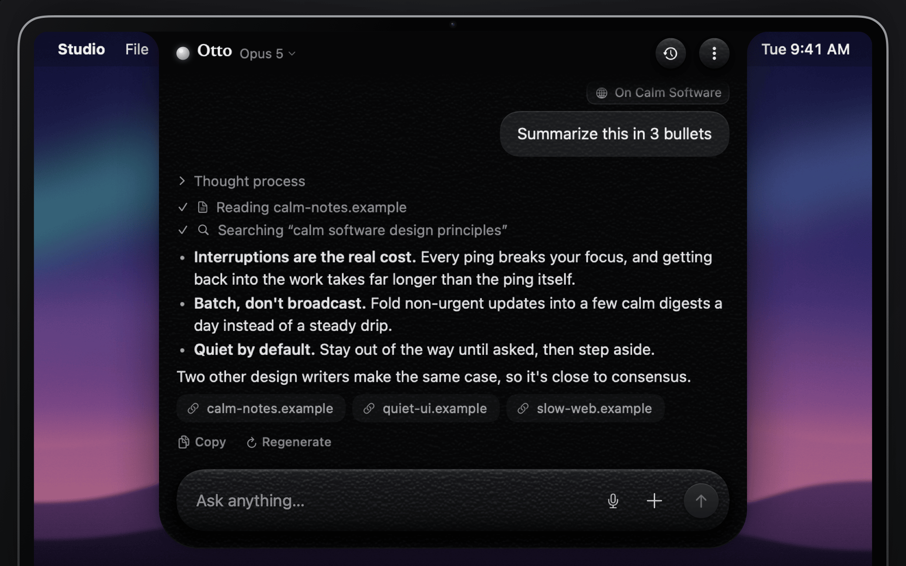
</p>

### Keeps working while you do

Close Otto mid-answer and the reply keeps coming. The notch grows two small ears, a breathing orb and a
writing glyph, while Claude works. When the answer is done, its first line drops under the camera for a
few seconds. Rest the pointer on it to keep it there, or click to open the answer. A warm dot stays until
you've read it.

<p align="center">
  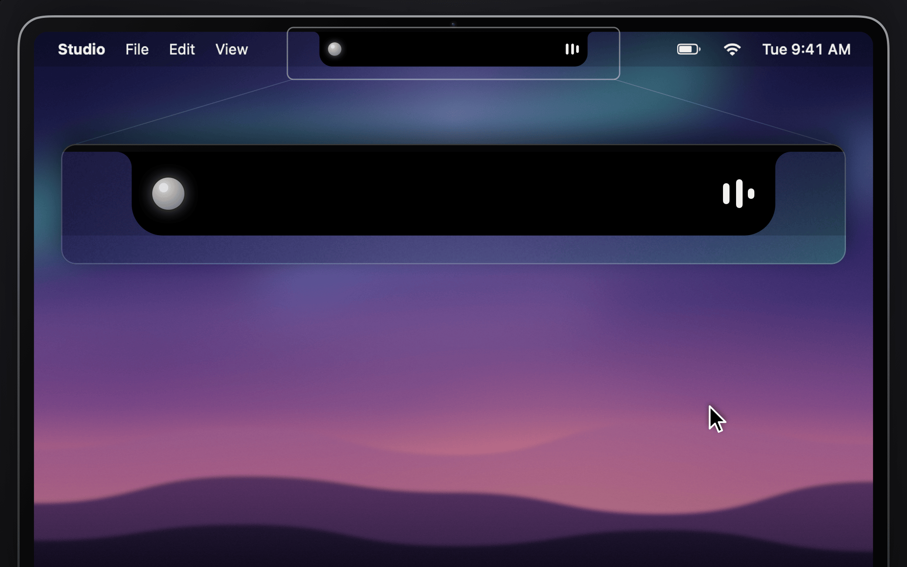
</p>

### Acts with your OK

Actions are off until you turn them on in **Settings → Actions**. Then Claude can add calendar events and
reminders, run your Shortcuts or open a link. Each one shows up first as a card with exactly what will be
added or run, and waits for your click or <kbd>⌘</kbd><kbd>↩</kbd>. The one way past the card is
**Always allow** on a shortcut you trust. An event or reminder Otto adds can be undone for 10 minutes.

<p align="center">
  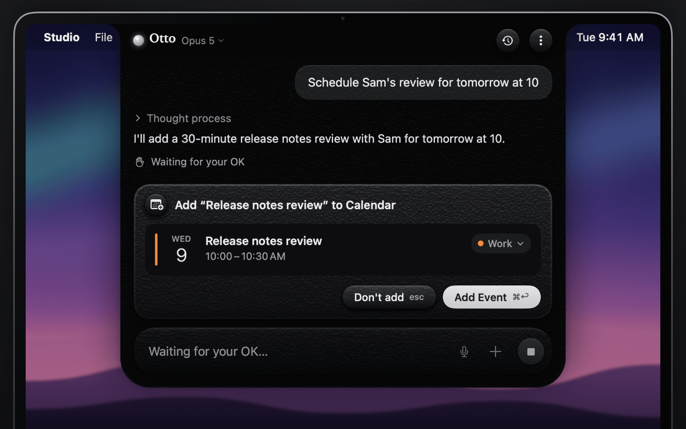
</p>

### Keeps files at hand

Drop files on the left half of the notch to park them on the Shelf, where they stay until you remove them.
Drag them out into any app, share them, or select a few and ask Otto about them. The Shelf keeps a link to
each file and never moves the original. <kbd>⌘</kbd><kbd>D</kbd> opens it.

<p align="center">
  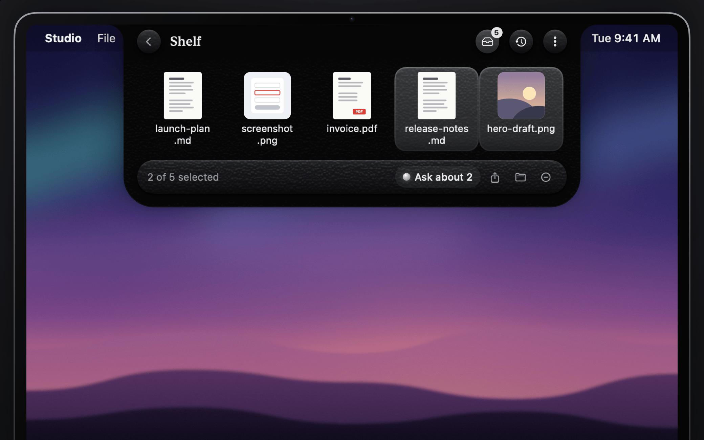
</p>

### Ask out loud

Turn on Voice, then hold <kbd>⌥</kbd><kbd>Space</kbd> and talk. Your words appear in the composer as you
speak, and letting go sends them. Speech is turned into text on your Mac unless you allow Apple's speech
service in **Settings → Voice**.

<p align="center">
  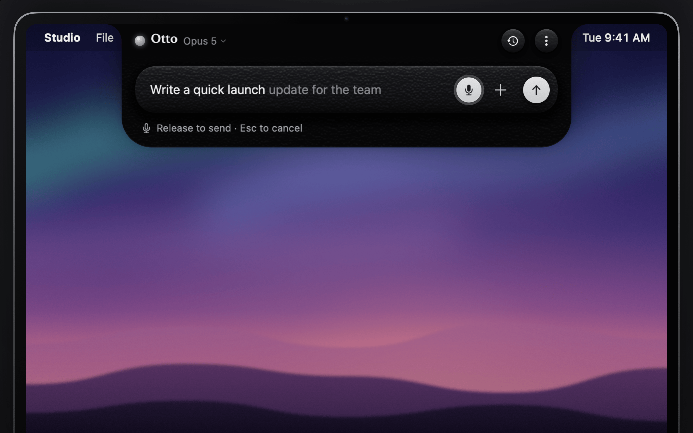
</p>

### Picks up where you left off

Conversations are saved on your Mac for 30 days by default. <kbd>⌘</kbd><kbd>Y</kbd> opens Recents,
grouped by day and searchable. Come back after 15 minutes away and Otto starts a fresh chat with a chip to
continue the last one. Reopen a chat and you're back where you were reading.

<p align="center">
  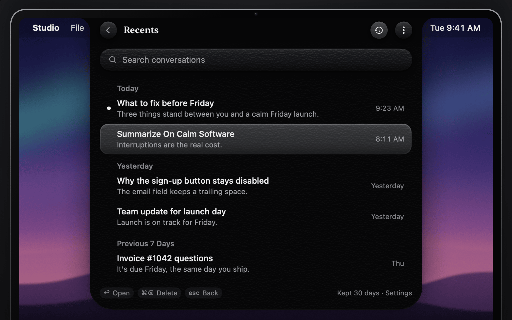
</p>

### Your key, your Mac

Your API key lives in the macOS Keychain. Nothing leaves your Mac until you press send, and then it
goes straight to Anthropic. History stays on your Mac. There's no account, no Otto server and no
telemetry. The two opt-in exceptions, Apple's speech service and Spotify artwork, are listed under
[Privacy & permissions](#privacy--permissions).

<p align="center">
  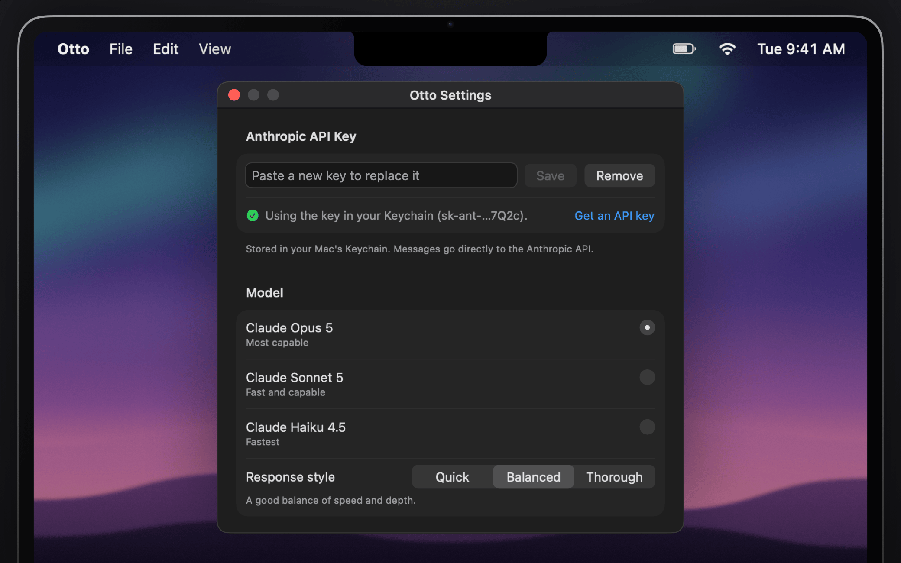
</p>

## Features

Chat, web search, the browser tab chip, History, reply previews and the File Shelf are on from the start.
Actions, Voice, Now Playing, the meeting chip, notifications and the selected-text chip stay off until you
turn them on, and anything that needs a macOS permission asks the first time you use it.

**Ask**

- Chat with Claude Opus 5, Sonnet 5 or Haiku 4.5, with web search, sources and a visible thought process.
- Regenerate a reply with <kbd>⌘</kbd><kbd>R</kbd> and flip between versions, or press <kbd>↑</kbd> to edit
  and resend your last message.
- Switch models from the header menu or with <kbd>⌘</kbd><kbd>1</kbd> to <kbd>⌘</kbd><kbd>3</kbd>.
- See what each reply cost on hover, with daily and monthly totals in **Settings → Models**. Otto never
  switches to a cheaper model on its own.

**Bring context in**

- Drop or paste files, images, PDFs and documents, or attach the current browser tab.
- **Ask about your selection.** Select text in any app and choose **Services → Ask Otto**, or turn on
  **Offer selected text** and Otto offers it as a chip when you open the notch.
- **Window chip.** Otto offers a picture of the window you were working in. Nothing is captured until you
  click the chip.
- **File Shelf.** Drop files on the left half of the notch to park them, then drag them out, share them or
  ask about them later. <kbd>⌘</kbd><kbd>D</kbd> opens the Shelf.

**Get answers out**

- **Paste into the app you came from.** Press <kbd>⌘</kbd><kbd>↩</kbd> on an answer and Otto pastes it
  where you were typing, or replaces the text you asked about. Your clipboard is put back afterwards.
- Copy the last reply with <kbd>⌘</kbd><kbd>⇧</kbd><kbd>C</kbd>.

**Actions** (off until you turn them on in **Settings → Actions**)

- Claude can read and add calendar events and reminders, run your Shortcuts, play, pause and skip in Music
  and Spotify, open links, and (if you turn it on separately) run AppleScript.
- Adding an event or reminder, running a shortcut or script, and opening a link each show a card with
  exactly what will run, down to the full script, and wait for you to press <kbd>⌘</kbd><kbd>↩</kbd> on this
  Mac's keyboard or click. A card you don't answer expires after 10 minutes.
- Three things can skip the card: play, pause and skip; reads, which ask once; and a shortcut you've marked
  **Always allow**. With **How Otto asks** on **Safer** (the default), even that shortcut asks again once
  Otto has read a web page in the chat.
- Events and reminders you add can be undone for 10 minutes.
- Each reply can add at most 5 events and 5 reminders, run 5 shortcuts (30 an hour), and run 3 scripts and
  open 3 links (20 of each an hour).
- A local activity log records what ran, without its contents.

**Voice**

- Off until you turn it on in **Settings → Voice**. Then hold your shortcut or the mic button to talk, and
  let go to send. Otto turns speech into text on your Mac and can read replies aloud.

**Glance**

- The closed notch shows what Otto is doing: thinking, searching, writing, waiting for your OK, or a
  one-line preview of a finished reply. Hover the preview to keep it, or click it to open the answer.
- Optional: what's playing in Music or Spotify, your next meeting with a button to join it, and a notification
  when a reply finishes while you're away.

**Stay in flow**

- Rest the pointer on the open notch and start typing; your text lands in Otto. Move away and the keyboard
  goes back to your app.
- Pin Otto open with <kbd>⌘</kbd><kbd>P</kbd>, or make it tall for long answers with
  <kbd>⌘</kbd><kbd>⇧</kbd><kbd>↑</kbd>. Reopening takes you back to where you were reading.
- Choose your own global shortcut, or turn off hover-to-open if another notch app lives there too.
- **History.** Conversations are saved on your Mac for 30 days by default. <kbd>⌘</kbd><kbd>Y</kbd> opens
  Recents, with search and undo for deletes. After 15 minutes away Otto starts a fresh chat and offers to
  continue the last one.
- <kbd>⌘</kbd><kbd>/</kbd> lists every shortcut that applies to your settings.

## Get started

Today you build Otto from source. It's free and takes a few minutes.

1. **Install** Xcode 16 or later from the App Store, then open it once.
2. **Install** XcodeGen: `brew install xcodegen`.
3. **Build and open** Otto with the commands in [Build from source](#build-from-source).
4. **Add your API key.** Settings opens on first launch. Create a key at
   [console.anthropic.com/settings/keys](https://console.anthropic.com/settings/keys), paste it in and
   click **Save**.
5. **Hover the notch** and ask.

A signed and notarized build is coming soon as a one-time purchase, so you won't need Xcode. To hear
when it ships, open the repo's [notification settings](https://github.com/jke48222/otto/subscription),
choose **Custom**, check **Releases** and click **Apply**.

> [!TIP]
> Otto has no Dock icon. It lives in the notch, with a small menu bar icon as a second way in.

## Everyday use

| To… | Do this |
| --- | --- |
| **Open Otto** | Rest the pointer on the notch for a beat, click it, or press your shortcut (<kbd>⌥</kbd><kbd>Space</kbd> unless you changed it). You can also pick **Open Otto** from the menu bar icon. |
| **Keep it open** | Click into it or start typing. A notch opened by hovering closes when your pointer leaves; once you engage, it stays until you dismiss it. <kbd>⌘</kbd><kbd>P</kbd> pins it open while you work in another app. |
| **Add context** | Drag files, images or links onto the notch (dragging onto the closed notch opens it), or paste with <kbd>⌘</kbd><kbd>V</kbd>. Drop on the left half to keep files on the Shelf instead. |
| **Use the + menu** | **Attach Files…**, **Capture Screen Region**, **Paste from Clipboard**, **Attach Selection from ‹App›**, **Attach ‹App› Window**, and **Attach Current Tab** when you're in a browser. |
| **Ask from another app** | Select text or files, then choose **Services → Ask Otto**, **Ask Otto About Files** or **Add to Otto Shelf** from the app's menu or the right-click menu. |
| **Ask about a web page** | In Safari or a Chromium-based browser, Otto shows the current tab as a dashed chip. Click it to attach the page. |
| **Send / stop** | Press <kbd>Return</kbd> or click ↑. While a reply streams, the same button stops it, and so does <kbd>⌘</kbd><kbd>.</kbd>. |
| **Talk** | Hold your shortcut or the mic button, speak, and let go. Or click the mic, speak, and click again. |
| **Use the answer** | Hover a reply for **Paste into ‹App›**, **Copy**, **Regenerate** and, if something went wrong, **Retry**. |
| **Approve an action** | Read the card in the notch, then press <kbd>⌘</kbd><kbd>↩</kbd> or click the main button once it's ready. <kbd>Esc</kbd> declines. |
| **Find an old chat** | <kbd>⌘</kbd><kbd>Y</kbd> opens Recents. Type to search, <kbd>Return</kbd> opens, <kbd>⌘</kbd><kbd>⌫</kbd> deletes and <kbd>⌘</kbd><kbd>Z</kbd> brings it back. |
| **Start over** | <kbd>⌘</kbd><kbd>N</kbd>, or **New Chat** in the ⋮ menu. |
| **Dismiss** | <kbd>Esc</kbd>, click anywhere outside Otto, or press your shortcut again. |

Otto reads images (PNG, JPEG, GIF, WebP, HEIC, TIFF and more), PDFs, plain text and source code, CSV,
JSON, RTF and Word documents, HTML files and web archives. You can attach up to 10 items per message,
and large images are downscaled before they're sent.

### Keyboard shortcuts

Press <kbd>⌘</kbd><kbd>/</kbd> in Otto to see the ones that apply to your settings.

| Shortcut | Where | Action |
| --- | --- | --- |
| <kbd>⌥</kbd><kbd>Space</kbd> (or your own) | Anywhere | Open Otto and focus the composer, or close it. Hold it to talk when Voice is on. |
| <kbd>Return</kbd> | Composer | Send (<kbd>⇧</kbd><kbd>Return</kbd> for a new line) |
| <kbd>⌘</kbd><kbd>.</kbd> | Otto | Stop the reply, stop listening, or stop speaking |
| <kbd>⌘</kbd><kbd>R</kbd> | Chat | Regenerate the last reply |
| <kbd>↑</kbd> | Empty composer | Edit and resend your last message (<kbd>Esc</kbd> cancels) |
| <kbd>⌘</kbd><kbd>⇧</kbd><kbd>C</kbd> | Otto | Copy the last reply |
| <kbd>⌘</kbd><kbd>↩</kbd> | Empty composer | Paste the last answer into the app you came from, or replace the text you asked about |
| <kbd>⌥</kbd><kbd>⌘</kbd><kbd>↩</kbd> | Empty composer | Paste the last answer as plain text |
| <kbd>⌘</kbd><kbd>↩</kbd> | Approval card | Run the action, once the card is ready |
| <kbd>Esc</kbd> | Card in the notch | Decline or dismiss it |
| <kbd>⌘</kbd><kbd>1</kbd> <kbd>⌘</kbd><kbd>2</kbd> <kbd>⌘</kbd><kbd>3</kbd> | Otto | Switch to Opus 5, Sonnet 5 or Haiku 4.5 |
| <kbd>⌘</kbd><kbd>P</kbd> | Otto | Pin open, or unpin |
| <kbd>⌘</kbd><kbd>⇧</kbd><kbd>↑</kbd> / <kbd>⌘</kbd><kbd>⇧</kbd><kbd>↓</kbd> | Otto | Tall reading mode on or off |
| <kbd>⌘</kbd><kbd>Y</kbd> | Otto | Recents (<kbd>⌘</kbd><kbd>F</kbd> search, <kbd>⌘</kbd><kbd>⌫</kbd> delete, <kbd>⌘</kbd><kbd>Z</kbd> undo) |
| <kbd>⌘</kbd><kbd>D</kbd> | Otto | Shelf (<kbd>⌘</kbd><kbd>↩</kbd> asks about the selected files, <kbd>⌥</kbd><kbd>⌘</kbd><kbd>R</kbd> reveals them in Finder) |
| <kbd>⌥</kbd><kbd>⌘</kbd><kbd>P</kbd> · <kbd>⌥</kbd><kbd>⌘</kbd><kbd>]</kbd> · <kbd>⌥</kbd><kbd>⌘</kbd><kbd>[</kbd> | Now Playing on | Play or pause · next track · previous track |
| <kbd>⌥</kbd><kbd>⌘</kbd><kbd>J</kbd> | Meeting chip on | Join your next meeting |
| <kbd>⌥</kbd><kbd>⌘</kbd><kbd>U</kbd> | Otto | Usage details |
| <kbd>⌘</kbd><kbd>/</kbd> | Otto | Show or hide the shortcut sheet |
| <kbd>⌘</kbd><kbd>N</kbd> | Otto | New chat |
| <kbd>⌘</kbd><kbd>V</kbd> | Otto | Paste: files and images become chips, text goes into the composer |
| <kbd>⌘</kbd><kbd>,</kbd> | Otto | Settings |
| <kbd>Esc</kbd> or <kbd>⌘</kbd><kbd>W</kbd> | Otto | Close (on Recents or the Shelf, <kbd>Esc</kbd> goes back to Chat first) |

When you only hover over Otto, typing works right away, but <kbd>⌘</kbd><kbd>↩</kbd>, <kbd>⌘</kbd><kbd>R</kbd>,
<kbd>⌘</kbd><kbd>N</kbd> and the other shortcuts that send, spend tokens, approve or paste wait for a click or
your first keystroke. They hand the keyboard back to your app instead, so a <kbd>⌘</kbd><kbd>↩</kbd> meant for
Mail never approves anything in Otto.

Change the global shortcut in **Settings → General**. If another app already holds a combination, Otto tells
you and keeps the old one.

## Privacy & permissions

Otto asks only for what a feature needs, and only when you first use that feature. Before any macOS
dialog, the notch explains in one sentence what the permission is for. While a macOS dialog or System
Settings is up, Otto folds itself out of the way so it never covers the switch you need, and comes back
when you're done.

| Permission | What Otto uses it for | When you'll see it |
| --- | --- | --- |
| **Automation** (per app) | Reads the **title and address** of your front browser tab so Otto can offer it as a chip. With Now Playing on, sends play, pause and skip to Music or Spotify when you press those buttons. With Actions on, lets an AppleScript you approved control the apps it names. | The first time you open Otto by click or shortcut with Safari, Chrome, Arc, Brave, Edge, Vivaldi or Opera in front; the first time you press a media control; the first time an approved script targets an app. |
| **Accessibility** | Presses <kbd>⌘</kbd><kbd>V</kbd> for you when you paste an answer into another app, and reads the text you've selected when **Offer selected text** is on. Never in the background, never in password fields. | The first time you paste an answer or turn on **Offer selected text**. **Services → Ask Otto** works without it. |
| **Screen & System Audio Recording** | **Capture Screen Region**, and the picture behind the window chip. Only when you click. | The first time you use either. macOS needs Otto to reopen after you turn it on, and Otto offers **Quit & Reopen Otto**. On macOS 15 and later, macOS may ask you to confirm again from time to time. |
| **Microphone** and **Speech Recognition** | Voice mode. Otto listens only while you hold the shortcut or the mic, and turns speech into text on your Mac. | When you turn on Voice. |
| **Calendars** | The next-meeting chip, and calendar actions. | When you turn on **Show my next event**, or the first time Claude reads or adds an event. |
| **Reminders** | Reminder actions. | The first time Claude reads or adds a reminder. |
| **Notifications** | A notification when a reply finishes, or needs your OK, while you can't see the notch. | When you pick a **Notify me** option other than **Never**. |

Shortcuts need no permission, because the Shortcuts app runs each shortcut under its own privacy settings.

> [!IMPORTANT]
> **Scripts you approve run with Otto's access, so macOS won't ask again.** An AppleScript runs as part of
> Otto, so it can use every permission you've given Otto (Accessibility, Screen Recording, Calendars, and the
> apps Otto may control) without a new macOS prompt. That's why AppleScript is off until you turn it on
> separately, why every script needs your approval, and why the approval card lists the access the script
> inherits before you run it. Otto blocks scripts that ask for administrator privileges, build code at run time
> or hide text.

**What leaves your Mac, and when.** Only when you press send, Otto sends your message, the items you
attached, your custom instructions and the current conversation directly to `api.anthropic.com` over
HTTPS. A suggested browser tab, selection or window isn't sent unless you attach it; for a tab, only its
title and address go. When web search or fetch is on, Claude runs those searches on Anthropic's side, at
most 10 searches and 10 page reads per reply. With Actions on, what a tool reads (for example your
calendar events) goes to Claude as part of the conversation, and Otto asks once before the first read.
Voice is turned into text on your Mac unless you allow Apple's speech service in **Settings → Voice**; the
audio is never stored and never sent to Anthropic. With Now Playing on, Otto downloads Spotify's album
artwork from Spotify's image servers.

**What stays.** Your API key is stored in your login Keychain and nowhere else. Otto has no analytics,
no crash reporting, no account and no server of its own. How Anthropic handles API data is covered by
[Anthropic's privacy policy](https://www.anthropic.com/legal/privacy).

**When the signed app ships**, it also talks to two more services. About once a day it checks your license
with Polar (`api.polar.sh`, or `api.gumroad.com` for a key bought on Gumroad): it sends the key, Otto's IDs
at Polar and this Mac's activation ID, never your name, email, Mac name or a hardware ID. Polar records the
time and count of each check with your purchase. Once a day it downloads the release list from Otto's site
and gets updates from Vercel's file storage; that request carries Otto's version number and nothing that
identifies you or your Mac. The Setapp build tells Setapp when you use Otto and makes no license checks. A
build from source does none of this.

**History and the activity log.** Otto keeps everything it saves in `~/Library/Application Support/Otto`,
readable only by your user account and excluded from Time Machine. Each data folder's name ends in
`.noindex` (`Conversations.noindex`, `Attachments.noindex`, `Shelf.noindex`, `Logs.noindex`), which keeps
Spotlight from indexing it. Conversations are kept for 30 days by default (7, 30 or 90 days, or forever, in
**Settings → Privacy**). Selections, Services text and window pictures are never saved with a
conversation: after a relaunch their chips say the content is no longer stored on this Mac. The actions
activity log keeps what ran and when: the action's title, a web address's host and, for an AppleScript, its
first 200 characters and a fingerprint (the full script only if you turn on **Keep full scripts in the
activity log**). It doesn't keep notes, inputs or outputs. It follows the same retention as your
conversations, and **Delete All History…** or turning History off clears it along with them. The usage
totals file holds token counts and costs, never message text. Your history is encrypted at rest only when
FileVault is on, and Settings warns you when it's off.

## Choosing a model

Pick a model in **Settings → Models**, from the model menu in Otto's header, or with <kbd>⌘</kbd><kbd>1</kbd>
to <kbd>⌘</kbd><kbd>3</kbd>. You can switch at any time; the next message uses the new choice.

| Model | Best for | Notes |
| --- | --- | --- |
| **Claude Opus 5** (default) | The hardest questions | Shows its thought process. If it's overloaded, Anthropic can finish your reply on a fallback model. |
| **Claude Sonnet 5** | Everyday questions, faster | Shows its thought process. |
| **Claude Haiku 4.5** | Quick lookups at the lowest cost | Web search only (no page fetch); no thinking or response style. |

**Response style** (Quick, Balanced, Thorough) sets how much effort Claude puts in. Quick is faster
and uses fewer tokens; Thorough takes longer and thinks harder.

**What it costs to run.** Claude usage is billed to your Anthropic account at
[Anthropic's API rates](https://www.anthropic.com/pricing), per token, and web searches add a per-search
fee. Haiku and the Quick style cost the least, and Otto uses prompt caching so follow-up questions in the
same chat cost less. Hover a reply to see what it cost, and see today's, this month's and all-time totals
in **Settings → Models**. These are estimates at list prices; your Anthropic Console has the bill. You can
set spend limits in the [Anthropic Console](https://console.anthropic.com).

## Limits and known issues

- **No signed download yet.** For now you build Otto from source with Xcode. The signed, notarized app
  is coming soon as a one-time purchase.
- **Keychain prompts after rebuilds.** Source builds are ad hoc signed, so macOS asks again whether Otto
  may read its Keychain item after each rebuild. Click **Always Allow**, or sign with your own identity
  (see [Build from source](#build-from-source)).
- **Permissions after rebuilds.** macOS ties Accessibility and Screen Recording to the app's signature,
  so an ad hoc signed source build loses them on every rebuild. Sign with your own identity to keep them
  (see [Build from source](#build-from-source)).
- **Approve with this Mac's keyboard or trackpad.** Approval cards ignore input that another app posts, so
  Voice Control, Screen Sharing and Universal Control can't approve an action. VoiceOver and Switch Control
  can.
- **Voice needs Dictation.** Otto uses macOS's speech recognizer, which stops working when Dictation is off
  in **System Settings → Keyboard**. Otto shows a card that takes you there.
- **Actions are Mac-only and local.** Calendar and reminders work with the accounts in Apple's Calendar and
  Reminders apps; media control works with Music and Spotify.
- **Some shortcuts can't be detected.** Otto registers its shortcut exclusively and tells you when another
  app holds it, but some launchers hold a combination in a way Otto can't see.
- **Browser tabs:** Safari and Chromium-based browsers (Chrome, Arc, Brave, Edge, Vivaldi, Opera) only.
  Firefox isn't supported.
- **Haiku 4.5** can search the web but can't fetch pages, and doesn't show a thought process.
- **Needs an Anthropic API key with credit.** A Claude.ai subscription is separate from API access and
  doesn't work here.
- **macOS 14 Sonoma or later** only.

## FAQ

<details>
<summary><strong>My Mac doesn't have a notch. Can I still use Otto?</strong></summary>

Yes. On Macs without a notch, Otto draws a slim virtual notch at the top center of your main display.
It works the same way.
</details>

<details>
<summary><strong>What about external displays?</strong></summary>

If your MacBook's built-in display is on, Otto lives in its notch. With the lid closed, or on a Mac with
only external displays, Otto places a virtual notch at the top center of the display with the menu bar.
It follows along when you plug displays in or out.
</details>

<details>
<summary><strong>How much does it cost?</strong></summary>

The source code is free under the MIT license, and building it yourself costs nothing. The signed app
will be a one-time purchase when it ships. Either way, you pay Anthropic for what you use, per token, on
your own API account. Set a monthly spend limit in the Anthropic Console if you want a hard cap.
</details>

<details>
<summary><strong>If the code is open source, what does the paid app add?</strong></summary>

A build that's signed with a Developer ID and notarized by Apple, so it opens like any other Mac app;
updates that install themselves; and a license that pays for development. It's the same code as this
repository. The license check and the updater compile only into the signed build, so you can read exactly
what they send.
</details>

<details>
<summary><strong>Why isn't Otto on the Mac App Store?</strong></summary>

Mac App Store apps must run in Apple's App Sandbox, and Otto's notch panel, global shortcut and browser
tab reading are built to run outside it. The signed app will be sold directly instead.
</details>

<details>
<summary><strong>What happens to my data?</strong></summary>

Nothing is sent anywhere until you press send, and then it goes straight to Anthropic's API. History,
the Shelf, usage totals and the activity log stay in `~/Library/Application Support/Otto` on your Mac, and
Otto has no telemetry. See [Privacy & permissions](#privacy--permissions).
</details>

<details>
<summary><strong>Why do I need my own API key?</strong></summary>

There's no middleman server relaying your messages, and you pay Anthropic only for what you use. Keys
take a minute to create at [console.anthropic.com](https://console.anthropic.com/settings/keys).
</details>

<details>
<summary><strong>Can I try Otto without a key?</strong></summary>

Yes. Demo mode plays a scripted, streamed reply (with thinking, a web search and sources) without
touching the network. From your clone, run:

```sh
scripts/run.sh --demo --open
```
</details>

<details>
<summary><strong>macOS asks whether Otto may use its Keychain item.</strong></summary>

That's Otto reading the API key you saved. Click **Always Allow**. Ad hoc signed source builds ask again
after each rebuild; see [Limits and known issues](#limits-and-known-issues).
</details>

<details>
<summary><strong><kbd>⌥</kbd><kbd>Space</kbd> opens a different app.</strong></summary>

Otto registers the shortcut exclusively, and Settings tells you if another app already holds it. Some
launchers register it in a way macOS can't detect. If that happens, pick a different shortcut in
**Settings → General**, or change it in the other app.
</details>

<details>
<summary><strong>How do I uninstall Otto?</strong></summary>

1. In Settings, turn off **Launch at login**, then choose **Quit Otto** from the ⋮ menu or menu bar icon.
2. Delete `Otto.app` (from Applications, or the `build/` folder of your clone).
3. Optional clean-up: in **Keychain Access**, delete the item named `com.jalenedusei.otto` (your API
   key), run `defaults delete com.jalenedusei.otto` to remove preferences, and delete
   `~/Library/Application Support/Otto` to remove your history, Shelf and activity log. The signed app
   also keeps its license and trial dates in the Keychain, in items named "Otto (license)" and
   "Otto (trial)"; delete them in Keychain Access.
</details>

## Build from source

You'll need macOS 14 or later, Xcode 16 or later (with its command line tools selected) and
[XcodeGen](https://github.com/yonaskolb/XcodeGen).

```sh
brew install xcodegen
git clone https://github.com/jke48222/otto.git
cd otto
scripts/run.sh --open     # build, then launch with the notch open
```

The app lands in `build/Build/Products/Debug/Otto.app`. Drag it to Applications if you want to keep it
there. It was built on your Mac, so Gatekeeper opens it without a warning.

| Script | What it does |
| --- | --- |
| `scripts/build.sh` | Generates `Otto.xcodeproj` and builds Debug into `build/Build/Products/Debug/Otto.app` |
| `scripts/run.sh [flags]` | Builds, stops any running Otto, and launches the fresh build with your flags |
| `scripts/snapshot.sh` | Builds, then renders UI snapshots into `docs/snapshots/` |
| `swift scripts/make_icon.swift` | Regenerates every size of the app icon |
| `scripts/make_media.sh` | Re-renders the stills in `docs/media/` and records raw promo footage from the real UI |
| `scripts/make_video.sh` | Cuts the promo film, its poster and the README loop from that footage (needs `ffmpeg`) |
| `scripts/build_site.sh` | Assembles the website from `site/` and `docs/media/` into `_site/` |
| `scripts/release.sh` | Builds, signs, notarizes and packages the paid or Setapp build (`--flavor`; see [docs/RELEASING.md](docs/RELEASING.md)) |
| `scripts/publish.sh` | Uploads a paid release, writes the signed appcast and updates the Homebrew cask |

The paid and Setapp builds are generated from `project-paid.yml` and `project-setapp.yml`. `Otto.xcodeproj`
never downloads a package.

Run the tests with:

```sh
xcodegen generate
xcodebuild -project Otto.xcodeproj -scheme Otto -configuration Debug -derivedDataPath build test
```

`Otto.xcodeproj` is generated from `project.yml` and isn't checked in. Run `xcodegen generate` and open it
to work in Xcode.

**Signing.** Builds are ad hoc signed by default, so no Apple Developer account is needed. To sign with
your own identity (which stops Keychain prompts after every rebuild), create `Config/Local.xcconfig`,
which is git-ignored:

```xcconfig
CODE_SIGN_IDENTITY = Apple Development
DEVELOPMENT_TEAM = ABCDE12345
```

Set `OTTO_ADHOC_SIGNING=1` to force an ad hoc signature for a single build.

**Launch flags.** Pass them with `scripts/run.sh <flags>` or `open Otto.app --args <flags>`.

| Flag | Effect |
| --- | --- |
| `--demo` | Uses the built-in mock client: a scripted, streamed reply with thinking, a web search and sources. Demo actions never touch your calendar, shortcuts, apps or browser, and demo data lives in `~/Library/Application Support/Otto/Demo`. No key or network needed. |
| `--open` | Opens the notch, focused, right after launch. |
| `--snapshot <dir>` | Debug builds only. Renders PNG snapshots of the UI in fixed states into `<dir>`, then quits. |
| `--selftest <dir>` | Debug builds only. Drives the real notch on screen through a scripted session (open, type, send, stream, close mid-reply, reopen, attach files, approve and decline actions, voice, Recents, the Shelf) with demo services and temporary stores, and checks the pointer logic against the live notch geometry. Writes `report.json` and PNG captures, then exits `0` only if every step passed. |
| `--license-state <state>`, `--license-clock-offset <hours>` | Debug builds of the paid flavor only. Show a license state or shift the license clock without touching your Keychain. |

**API key from the environment.** With no key in the Keychain, Otto falls back to `ANTHROPIC_API_KEY`.
Apps opened from Finder don't inherit your shell's environment, so run the binary directly:

```sh
ANTHROPIC_API_KEY=sk-ant-… build/Build/Products/Debug/Otto.app/Contents/MacOS/Otto
```

## How it works

Otto is an accessory app (no Dock icon) built with AppKit for the window and event plumbing and SwiftUI
for everything you see. The source build uses only Apple frameworks. The signed app adds Sparkle for updates,
and the Setapp build adds the Setapp Framework.

```
Otto/
├── App/          entry point, AppComposition, launch options, hot key, menu bar item, Settings window, settings
├── Notch/        borderless panel, pointer state machine, geometry, key map, NotchViewModel
├── Chat/         shared model types, ChatSession (conversation, streaming, tool loop), system prompt
├── API/          AnthropicClient (HTTPS + server-sent events), stream accumulator, mock client, Keychain
├── Tools/        tool protocol, executor, approvals, trust and echo checks, rate limits, activity log
├── Actions/      calendar and reminders (EventKit), Shortcuts, AppleScript, links
├── Permissions/  the one place Otto checks and requests macOS permissions
├── Context/      attachments, browser tab, selection, window capture, paste into other apps
├── Voice/        speech engine, level meter, spoken replies
├── History/      conversation store, titles, search, Recents
├── Glance/       closed-notch glyphs, reply preview, notifications, next meeting
├── Media/        Now Playing and media controls
├── Shelf/        File Shelf store, thumbnails, drag and share
├── Usage/        pricing, usage ledger, cost labels
├── Licensing/    paid build only: the trial, Polar and Gumroad license keys, their Keychain records
├── Updates/      Sparkle updates in the paid build, Setapp's updater in the Setapp build
├── Setapp/       Setapp build only: usage events and release notes
├── UI/           SwiftUI views: notch, dock cards, pages, chat, glance, voice, Settings panes, theme
└── Debug/        Debug-build tools: snapshot renderer, on-screen self-test, promo stage for the launch media
```

A transparent, non-activating panel sits over the notch and only accepts clicks inside the shape it
draws, so everything else passes through to your apps and the menu bar. The global shortcut uses the
Carbon hot-key API, so opening Otto doesn't need Accessibility access; only pasting into other apps and
reading a selection do. `ChatSession` builds each request and streams `POST /v1/messages`; the stream is
folded into text, thinking, tool calls and sources as it arrives. When Claude asks for a tool, the executor
validates the input, shows the approval card, runs the tool and sends every result back in one message
before the reply continues. Request bodies are encoded with sorted keys so the prompt prefix stays
byte-stable for prompt caching. The suite has more than 1,700 unit tests, and the full design spec, with
every module interface, is in [`docs/SPEC.md`](docs/SPEC.md).

## Roadmap

Otto 1.1 shipped most of the old list: history, asking about your selection, pasting answers anywhere,
voice, calendar and reminders, media controls, Shortcuts and AppleScript actions, the File Shelf and a
custom shortcut. Still to come:

- **The signed app:** a notarized build sold as a one-time purchase.

Have an idea? [Open a feature request](https://github.com/jke48222/otto/issues/new?template=feature_request.yml).

## Contributing

Bug reports, ideas and pull requests are welcome. Start with [CONTRIBUTING.md](CONTRIBUTING.md) for
setup, project layout, conventions and the PR checklist. Please follow the
[Code of Conduct](CODE_OF_CONDUCT.md), and report security issues privately as described in
[SECURITY.md](SECURITY.md).

### Human QA

Some things only a person on a real Mac can check: macOS permission dialogs, System Settings, real hardware
input and real apps. Before each release someone runs the
[v1.1 release gate](docs/RELEASING.md#v11-release-gate) on a signed build and records pass or fail with the
macOS build number. It covers:

- Approvals ignore synthetic input: a <kbd>⌘</kbd><kbd>↩</kbd> posted by another app, or held down from an
  earlier paste, never runs an action.
- System dialogs and System Settings are never hidden under the notch, even at full or tall height.
- Typing after hovering, and a pinned notch that never steals a keystroke meant for another app.
- Settings on the current Space and over full-screen apps; a custom shortcut and its conflict messages;
  another notch app running alongside.
- Voice with the shortcut held in another app, AirPods switching profiles, Dictation off, and a screen lock
  mid-sentence.
- Services, paste and replace into Notes and Terminal, other keyboard layouts, and a password manager's
  clipboard.
- The window chip, Screen Recording and Quit & Reopen; the Shelf with Finder and AirDrop; Recents, undo,
  relaunch and Spotlight staying out of Otto's folders.
- Every action group with real apps and a real API key, lock-screen notifications and the paid build's checks.

## License

Otto's source code is released under the [MIT License](LICENSE). © 2026 Jalen Edusei.

## Acknowledgments

- The [Claude API](https://www.anthropic.com/api) from Anthropic, which writes the answers.
- [XcodeGen](https://github.com/yonaskolb/XcodeGen), which keeps the Xcode project out of version control.
- [Shields.io](https://shields.io) for the badges, and the
  [Contributor Covenant](https://www.contributor-covenant.org) for the code of conduct.

<sub>Otto is an independent project. It is not affiliated with, endorsed by or sponsored by Anthropic.
Claude and Anthropic are trademarks of Anthropic, PBC. Mac, MacBook and macOS are trademarks of Apple
Inc.</sub>
